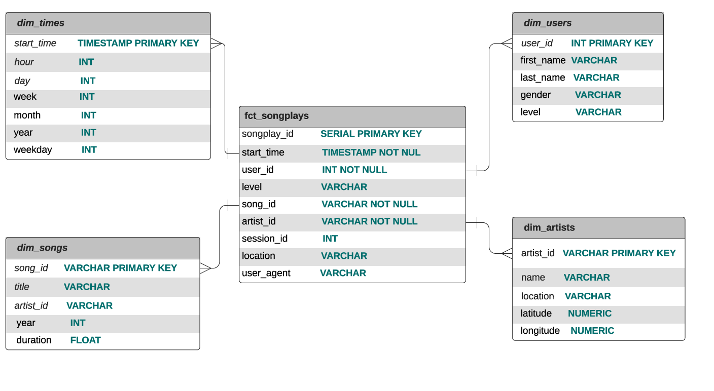

# Project: Data Modeling with Postgres

## Introduction
A startup called Sparkify wants to analyze the data they've been collecting on songs and user activity on their new music streaming app. The analytics team is particularly interested in understanding what songs users are listening to. Currently, they don't have an easy way to query their data, which resides in a directory of JSON logs on user activity on the app, as well as a directory with JSON metadata on the songs in their app.

They'd like a data engineer to create a Postgres database with tables designed to optimize queries on song play analysis, and bring you on the project. Your role is to create a database schema and ETL pipeline for this analysis. You'll be able to test your database and ETL pipeline by running queries given to you by the analytics team from Sparkify and compare your results with their expected results.

## Project Description

Since the analytics team would like to understand what songs users are listening to, we need to give them an easy way to do that as a Data Engeineer. The JSON data should be extracted and put together in a way that makes the data readily available to the analytics team. We choosed postgres and designed the tables using Star Schema.

And because the team might need to do fast aggregations on large amounts of data, we decided to denormalized the Star Schema, therefore a fct table called fct_songplay was created, as this allows for fast aggregations and simplified queries.

The ETL pipeline is also there to process and import data into the existing data model.

##  Database Schema
There are 4 dimension tables and 1 fact table



This design offers flexibility with the queries being used for analysis. Here are some example queries:
What are the top 10 most popular songs for the users on different levels?
What is the distribution of their released years?
Who are the most popular artists in 2018? And where are they from?

##  ETL Process
#### Song Dataset
The first dataset is a subset of real data from the Million Song Dataset. Each file is in JSON format and contains
metadata about a song and the artist of that song. The files are partitioned by the first three letters of each song's
track ID. For example, here are filepaths to two files in this dataset.

```song_data/A/B/C/TRABCEI128F424C983.json
song_data/A/A/B/TRAABJL12903CDCF1A.json
```
And below is an example of what a single song file, TRAABJL12903CDCF1A.json, looks like.

```{
    "num_songs": 1,
    "artist_id": "ARJIE2Y1187B994AB7",
    "artist_latitude": null,
    "artist_longitude": null,
    "artist_location": "",
    "artist_name": "Line Renaud",
    "song_id": "SOUPIRU12A6D4FA1E1",
    "title": "Der Kleine Dompfaff",
     "duration": 152.92036,
     "year": 0
 }```

This information is parsed to populate the dim_songs and dim_artists Dimension tables.

#### Log Dataset
The log files in the dataset are partitioned by year and month. For example, here are filepaths to two files in this dataset.

```log_data/2018/11/2018-11-12-events.json
log_data/2018/11/2018-11-13-events.json
```
This data contains information of which songs Users listened to at a specific time. Information is parsed to provide
data for the fct_songplays table and the dim_user and dim_times tables. The fct_songplays.artist_id and fct_songplays.song_id
columns are populated by a lookup based on Artist Name Song Title respectively .


## File guide:

#### 1. sql_queries.py

This file contains all the SQL queries that will CREATE, INSERT, and SELECT from the Fact and Dimension tables.

#### 2. create_tables.py

This file runs the CREATE queries in **sql_queries.py** and create the fact and dimension tables, before the table creation, DROP queries in **sql_queries.py** will get executed first to drop tables that the CREATE queries are going to create.

#### 3. etl.py

This file processes json files and insert all the correct data entries into the fct/dimension tables.

#### 4. test.ipynb
This notebook shows the queries I ran while building up the elt to make sure the correct data got inerted into tables correctly


## How to run?
simply run below command in the project directory on Linux/Mac terminal:
```./run-test.sh```

The command does a few things:
* 1: creates a python3 virtual environment
* 2: install all modules required by this project
* 3: run **create_tables.py**
* 4: run **etl.py**
* 5: deactivate the virtual environment

## Acknowledgments
* With help from Udacity Team
